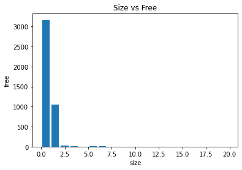

# introOsSimulator

### Work deligation

| person | role | 
| --- | --- | 
| Cade Lueker | part 1 and the graph. | 
| Isabella Robert Llorens | part two and getting nice output. |

> we both worked with eachother on the respective parts to edit/ offer suggestions it was a very 50/50 partnership.

- **Part 1** uses random integers to determine the block size of requests and the number of requests that take place. When running the simulation we try to run a series of requests followed by a series of 'free()'s to see how likely it is that memory is avliable under different conditions.
    - we tried to visualize this using python scripting in jupyter notebook

| number of free vs Size of request |
| --- |
|  |

- **Part 2** uses First Fit allocation algorithm to allocate the incoming processes to memory
    - Memory size and block size is randomized (in between a set range) each time it is run to simulate different sized memory
    - The amount and size of incoming processes is also randomized
> Sample Outputs for Part 2
> 1
```request at t=1660 for i=230, size(i)=10 pages, satisfied by free block of size 424                                                               
request at t=1718 for i=146, size(i)=6 pages, satisfied by free block of size 223                                                                
request at t=1723 for i=303, size(i)=3 pages, satisfied by free block of size 385                                                                
request at t=1726 for i=393, size(i)=13 pages, satisfied by free block of size 408                                                               
request at t=1729 for i=301, size(i)=1 pages, satisfied by free block of size 377                                                                
request at t=1732 for i=352, size(i)=12 pages, satisfied by free block of size 369                                                               
request at t=1734 for i=88, size(i)=8 pages, satisfied by free block of size 124                                                                 
request at t=1737 for i=298, size(i)=18 pages, satisfied by free block of size 376                                                               
request at t=1740 for i=223, size(i)=3 pages, satisfied by free block of size 286                                                                
request at t=1743 for i=288, size(i)=8 pages, satisfied by free block of size 455                                                                
request at t=1745 for i=356, size(i)=16 pages, satisfied by free block of size 446                                                               
request at t=1748 for i=33, size(i)=13 pages, satisfied by free block of size 99                                                                 
request at t=1751 for i=123, size(i)=3 pages, satisfied by free block of size 132                                                                
request at t=1754 for i=357, size(i)=17 pages, satisfied by free block of size 426                                                               
request at t=1757 for i=199, size(i)=19 pages, satisfied by free block of size 312                                                               
request at t=1785 for i=396, size(i)=16 pages, satisfied by free block of size 412                                                               
request at t=1793 for i=263, size(i)=3 pages, satisfied by free block of size 322                                                                
request at t=1796 for i=364, size(i)=4 pages, satisfied by free block of size 376                                                                
request at t=1824 for i=171, size(i)=11 pages, satisfied by free block of size 327                                                               
request at t=1862 for i=271, size(i)=11 pages, satisfied by free block of size 332                                                               
request at t=1896 for i=266, size(i)=6 pages, satisfied by free block of size 336                                                                
Degree of Fragmentation: 20                                                                                                                      
request at t=1921 for i=230, size(i)=10 pages, satisfied by free block of size 424                                                               
request at t=1924 for i=130, size(i)=10 pages, satisfied by free block of size 223                                                               
request at t=1927 for i=373, size(i)=13 pages, satisfied by free block of size 416                                                               
request at t=1930 for i=216, size(i)=16 pages, satisfied by free block of size 242                                                               
request at t=1932 for i=303, size(i)=3 pages, satisfied by free block of size 329                                                                
request at t=1935 for i=183, size(i)=3 pages, satisfied by free block of size 186                                                                
request at t=1938 for i=294, size(i)=14 pages, satisfied by free block of size 339                                                               
request at t=1942 for i=139, size(i)=19 pages, satisfied by free block of size 166                                                               
request at t=1971 for i=108, size(i)=8 pages, satisfied by free block of size 111                                                                
request at t=2000 for i=175, size(i)=15 pages, satisfied by free block of size 281                                                               
request at t=2006 for i=71, size(i)=11 pages, satisfied by free block of size 74                                                                 
request at t=2011 for i=176, size(i)=16 pages, satisfied by free block of size 232                                                               
request at t=2014 for i=54, size(i)=14 pages, satisfied by free block of size 67                                                                 
request at t=2018 for i=227, size(i)=7 pages, satisfied by free block of size 267                                                                
request at t=2021 for i=44, size(i)=4 pages, satisfied by free block of size 108                                                                 
request at t=2051 for i=342, size(i)=2 pages, satisfied by free block of size 396                                                                
request at t=2079 for i=192, size(i)=12 pages, satisfied by free block of size 267                                                               
request at t=2084 for i=99, size(i)=19 pages, satisfied by free block of size 169                                                                
request at t=2087 for i=279, size(i)=19 pages, satisfied by free block of size 451                                                               
request at t=2090 for i=371, size(i)=11 pages, satisfied by free block of size 447                                                               
request at t=2117 for i=27, size(i)=7 pages, satisfied by free block of size 70                                                                  
request at t=2146 for i=123, size(i)=3 pages, satisfied by free block of size 170                                                                
request at t=2175 for i=315, size(i)=15 pages, satisfied by free block of size 450                                                               
Degree of Fragmentation: 31                                                                                                                      
request at t=2218 for i=36, size(i)=16 pages, satisfied by free block of size 124                                                                
request at t=2222 for i=21, size(i)=1 pages, satisfied by free block of size 385                                                                 
request at t=2225 for i=392, size(i)=12 pages, satisfied by free block of size 408                                                               
request at t=2228 for i=199, size(i)=19 pages, satisfied by free block of size 377                                                               
request at t=2230 for i=248, size(i)=8 pages, satisfied by free block of size 286                                                                
request at t=2233 for i=111, size(i)=11 pages, satisfied by free block of size 369                                                               
request at t=2236 for i=287, size(i)=7 pages, satisfied by free block of size 376                                                                
request at t=2239 for i=403, size(i)=3 pages, satisfied by free block of size 404                                                                
request at t=2241 for i=114, size(i)=14 pages, satisfied by free block of size 172                                                               
request at t=2248 for i=395, size(i)=15 pages, satisfied by free block of size 447                                                               
request at t=2251 for i=389, size(i)=9 pages, satisfied by free block of size 392                                                                
request at t=2277 for i=273, size(i)=13 pages, satisfied by free block of size 305                                                               
request at t=2282 for i=419, size(i)=19 pages, satisfied by free block of size 433                                                               
Degree of Fragmentation: 42                                                                                                                      
Degree of Fragmentation: 0   
```
> 2
```
request at t=1642 for i=144, size(i)=4 pages, satisfied by free block of size 417                                                                
request at t=1700 for i=278, size(i)=18 pages, satisfied by free block of size 403                                                               
request at t=1705 for i=114, size(i)=14 pages, satisfied by free block of size 242                                                               
request at t=1708 for i=62, size(i)=2 pages, satisfied by free block of size 93                                                                  
Degree of Fragmentation: 2                                                                                                                       
request at t=1727 for i=291, size(i)=11 pages, satisfied by free block of size 412                                                               
Degree of Fragmentation: 2                                                                                                                       
request at t=1735 for i=98, size(i)=18 pages, satisfied by free block of size 417                                                                
request at t=1738 for i=29, size(i)=9 pages, satisfied by free block of size 92                                                                  
request at t=1741 for i=252, size(i)=12 pages, satisfied by free block of size 322                                                               
request at t=1744 for i=276, size(i)=16 pages, satisfied by free block of size 288                                                               
request at t=1773 for i=130, size(i)=10 pages, satisfied by free block of size 236                                                               
request at t=1779 for i=106, size(i)=6 pages, satisfied by free block of size 246                                                                
request at t=1783 for i=92, size(i)=12 pages, satisfied by free block of size 142                                                                
Degree of Fragmentation: 7                                                                                                                       
request at t=1815 for i=60, size(i)=0 pages, satisfied by free block of size 133                                                                 
request at t=1818 for i=303, size(i)=3 pages, satisfied by free block of size 368                                                                
request at t=1821 for i=248, size(i)=8 pages, satisfied by free block of size 346                                                                
request at t=1825 for i=355, size(i)=15 pages, satisfied by free block of size 392                                                               
request at t=1829 for i=76, size(i)=16 pages, satisfied by free block of size 109                                                                
request at t=1856 for i=184, size(i)=4 pages, satisfied by free block of size 249                                                                
request at t=1904 for i=324, size(i)=4 pages, satisfied by free block of size 462                                                                
request at t=1933 for i=65, size(i)=5 pages, satisfied by free block of size 111                                                                 
request at t=1937 for i=190, size(i)=10 pages, satisfied by free block of size 218                                                               
request at t=1940 for i=400, size(i)=0 pages, satisfied by free block of size 428                                                                
request at t=1943 for i=324, size(i)=4 pages, satisfied by free block of size 339                                                                
request at t=1946 for i=284, size(i)=4 pages, satisfied by free block of size 299                                                                
request at t=1949 for i=42, size(i)=2 pages, satisfied by free block of size 116                                                                 
request at t=1951 for i=281, size(i)=1 pages, satisfied by free block of size 324                                                                
request at t=1955 for i=316, size(i)=16 pages, satisfied by free block of size 344                                                               
Degree of Fragmentation: 17                                                                                                                      
request at t=1997 for i=285, size(i)=5 pages, satisfied by free block of size 390                                                                
request at t=2026 for i=118, size(i)=18 pages, satisfied by free block of size 250                                                               
request at t=2031 for i=287, size(i)=7 pages, satisfied by free block of size 457                                                                
request at t=2034 for i=364, size(i)=4 pages, satisfied by free block of size 437                                                                
request at t=2038 for i=127, size(i)=7 pages, satisfied by free block of size 275                                                                
request at t=2040 for i=119, size(i)=19 pages, satisfied by free block of size 209                                                               
request at t=2043 for i=172, size(i)=12 pages, satisfied by free block of size 344                                                               
request at t=2046 for i=189, size(i)=9 pages, satisfied by free block of size 289                                                                
Degree of Fragmentation: 21                                                                                                                      
Degree of Fragmentation: 0  
```
